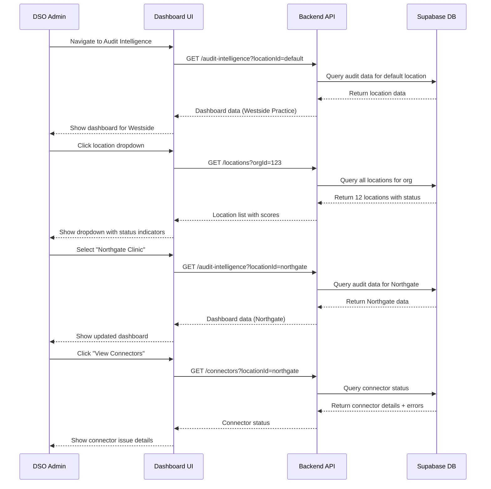

# Core Flows: Audit Intelligence Platform

## Overview

This document defines the key user flows for the Audit Intelligence platform, showing how practice managers, compliance officers, and DSO admins interact with the system to monitor compliance, generate documents, and investigate anomalies.

**Primary User Personas:**

- **Practice Manager** - Sets up connector, monitors compliance, generates reports
- **Compliance Officer** - Investigates alerts, reviews audit logs, generates compliance documents
- **DSO Admin** - Manages multiple locations, views org-wide compliance status

---

## Flow 1: First-Time Connector Setup

**Trigger:** Practice manager logs in for the first time after purchasing Audit Intelligence

**User Goal:** Install Windows connector and start collecting audit logs from Open Dental

### Steps

1. **User navigates to Audit Intelligence**
  - Clicks "Audit Intelligence" in sidebar (new top-level nav item)
  - Sees empty state dashboard with prominent "Get Started" CTA
2. **Empty state prompts setup**
  - Large hero section explains value: "Automate compliance monitoring with real-time audit logs"
  - Primary CTA button: "Setup Connector" (blue, prominent)
  - Secondary link: "Learn how it works" (opens help doc)
3. **User clicks "Setup Connector"**
  - Navigates to `/dashboard/audit-intelligence/connectors`
  - Sees connector setup wizard
4. **Download connector installer**
  - Step 1 of wizard: "Download Connector"
  - Shows system requirements (Windows 10+, admin access)
  - Large "Download Installer" button (downloads MSI file)
  - Progress indicator shows: Step 1 of 3
5. **Install connector on practice computer**
  - User runs MSI installer on Windows machine
  - Installer prompts for admin privileges
  - Installs Windows service silently in background
  - Opens browser to activation page automatically
6. **Activate connector**
  - Browser opens to activation URL (auto-detected or manual entry)
  - User already logged into SaaS platform (same session)
  - Sees "Activate Connector" page
  - Selects location from dropdown (if multi-location org)
  - Clicks "Generate Activation Token"
  - Token displayed with "Copy to Clipboard" button
7. **Paste token into connector**
  - Connector setup wizard shows token input field
  - User pastes token
  - Clicks "Activate"
  - Connector validates token with SaaS API
  - Shows success message: "Connected to [Location Name]"
8. **Configure Open Dental connection**
  - Step 2 of wizard: "Connect to Open Dental"
  - User enters Open Dental API credentials
  - Clicks "Test Connection"
  - System validates connection, shows success
  - Connector begins initial sync (pulls last 30 days of audit logs)
9. **Completion**
  - Step 3 of wizard: "You're all set!"
  - Shows connector status: "Active - Syncing every 5 minutes"
  - CTA: "View Dashboard" (returns to Audit Intelligence dashboard)
  - Dashboard now shows live data instead of empty state

### Wireframe: Empty State Dashboard

```wireframe
<!DOCTYPE html>
<html>
<head>
<style>
* { margin: 0; padding: 0; box-sizing: border-box; }
body { font-family: -apple-system, BlinkMacSystemFont, 'Segoe UI', sans-serif; background: #0d1117; color: #c9d1d9; padding: 80px 20px 20px 280px; }
.container { max-width: 1200px; margin: 0 auto; }
.empty-state { text-align: center; padding: 120px 40px; background: rgba(255,255,255,0.02); border: 1px solid rgba(255,255,255,0.06); border-radius: 16px; }
.icon { width: 80px; height: 80px; margin: 0 auto 24px; background: rgba(88,166,255,0.1); border-radius: 50%; display: flex; align-items: center; justify-content: center; font-size: 40px; }
h1 { font-size: 32px; margin-bottom: 16px; }
.subtitle { font-size: 18px; color: rgba(201,209,217,0.6); margin-bottom: 40px; max-width: 600px; margin-left: auto; margin-right: auto; }
.cta-primary { background: #58a6ff; color: #fff; border: none; padding: 16px 32px; font-size: 16px; font-weight: 600; border-radius: 8px; cursor: pointer; margin-right: 16px; }
.cta-secondary { background: transparent; color: #58a6ff; border: 1px solid #58a6ff; padding: 16px 32px; font-size: 16px; font-weight: 600; border-radius: 8px; cursor: pointer; }
.features { display: grid; grid-template-columns: repeat(3, 1fr); gap: 24px; margin-top: 60px; text-align: left; }
.feature { padding: 24px; background: rgba(255,255,255,0.02); border: 1px solid rgba(255,255,255,0.06); border-radius: 12px; }
.feature-icon { font-size: 24px; margin-bottom: 12px; }
.feature h3 { font-size: 16px; margin-bottom: 8px; }
.feature p { font-size: 14px; color: rgba(201,209,217,0.6); line-height: 1.5; }
</style>
</head>
<body>
<div class="container">
  <div class="empty-state">
    <div class="icon">🔌</div>
    <h1>Connect Your Practice Management System</h1>
    <p class="subtitle">Start monitoring HIPAA compliance in real-time by connecting to Open Dental. Automate audit log collection and eliminate manual compliance work.</p>
    <div>
      <button class="cta-primary" data-element-id="setup-connector-btn">Setup Connector</button>
      <button class="cta-secondary" data-element-id="learn-more-btn">Learn How It Works</button>
    </div>
  </div>
  
  <div class="features">
    <div class="feature">
      <div class="feature-icon">⚡</div>
      <h3>Real-Time Monitoring</h3>
      <p>Audit logs synced every 5 minutes. Know your compliance status instantly, not quarterly.</p>
    </div>
    <div class="feature">
      <div class="feature-icon">🤖</div>
      <h3>AI-Generated Documents</h3>
      <p>Generate Security Risk Assessments, Audit Reports, and more with one click.</p>
    </div>
    <div class="feature">
      <div class="feature-icon">🚨</div>
      <h3>Proactive Alerts</h3>
      <p>Detect shared logins, excessive access, and compliance gaps automatically.</p>
    </div>
  </div>
</div>
</body>
</html>
```

### Wireframe: Connector Setup Wizard

```wireframe
<!DOCTYPE html>
<html>
<head>
<style>
* { margin: 0; padding: 0; box-sizing: border-box; }
body { font-family: -apple-system, BlinkMacSystemFont, 'Segoe UI', sans-serif; background: #0d1117; color: #c9d1d9; padding: 80px 20px 20px 280px; }
.container { max-width: 800px; margin: 0 auto; }
.wizard { background: rgba(255,255,255,0.02); border: 1px solid rgba(255,255,255,0.06); border-radius: 16px; padding: 40px; }
.progress { display: flex; justify-content: space-between; margin-bottom: 40px; }
.step { flex: 1; text-align: center; position: relative; }
.step::after { content: ''; position: absolute; top: 16px; left: 50%; width: 100%; height: 2px; background: rgba(255,255,255,0.1); z-index: -1; }
.step:last-child::after { display: none; }
.step-circle { width: 32px; height: 32px; border-radius: 50%; background: rgba(255,255,255,0.1); border: 2px solid rgba(255,255,255,0.2); margin: 0 auto 8px; display: flex; align-items: center; justify-content: center; font-weight: 600; }
.step.active .step-circle { background: #58a6ff; border-color: #58a6ff; color: #fff; }
.step.completed .step-circle { background: #3fb950; border-color: #3fb950; color: #fff; }
.step-label { font-size: 12px; color: rgba(201,209,217,0.5); }
.step.active .step-label { color: #58a6ff; }
h2 { font-size: 24px; margin-bottom: 8px; }
.subtitle { font-size: 14px; color: rgba(201,209,217,0.6); margin-bottom: 32px; }
.download-box { background: rgba(88,166,255,0.05); border: 2px dashed rgba(88,166,255,0.3); border-radius: 12px; padding: 32px; text-align: center; margin-bottom: 24px; }
.download-icon { font-size: 48px; margin-bottom: 16px; }
.download-btn { background: #58a6ff; color: #fff; border: none; padding: 14px 28px; font-size: 15px; font-weight: 600; border-radius: 8px; cursor: pointer; }
.requirements { background: rgba(255,255,255,0.02); border: 1px solid rgba(255,255,255,0.06); border-radius: 8px; padding: 16px; margin-top: 24px; }
.requirements h4 { font-size: 13px; margin-bottom: 12px; color: rgba(201,209,217,0.8); }
.requirements ul { list-style: none; font-size: 13px; color: rgba(201,209,217,0.6); }
.requirements li { padding: 4px 0; padding-left: 20px; position: relative; }
.requirements li::before { content: '✓'; position: absolute; left: 0; color: #3fb950; }
.actions { display: flex; justify-content: space-between; margin-top: 32px; padding-top: 24px; border-top: 1px solid rgba(255,255,255,0.06); }
.btn-secondary { background: transparent; color: rgba(201,209,217,0.8); border: 1px solid rgba(255,255,255,0.2); padding: 10px 20px; font-size: 14px; border-radius: 6px; cursor: pointer; }
</style>
</head>
<body>
<div class="container">
  <div class="wizard">
    <div class="progress">
      <div class="step active">
        <div class="step-circle">1</div>
        <div class="step-label">Download</div>
      </div>
      <div class="step">
        <div class="step-circle">2</div>
        <div class="step-label">Activate</div>
      </div>
      <div class="step">
        <div class="step-circle">3</div>
        <div class="step-label">Connect</div>
      </div>
    </div>
    
    <h2>Download Connector</h2>
    <p class="subtitle">Install the ScaleHouse connector on your practice computer to start collecting audit logs from Open Dental.</p>
    
    <div class="download-box">
      <div class="download-icon">💾</div>
      <h3 style="margin-bottom: 8px;">Windows Connector v1.0.0</h3>
      <p style="font-size: 13px; color: rgba(201,209,217,0.5); margin-bottom: 20px;">12.4 MB • Compatible with Windows 10+</p>
      <button class="download-btn" data-element-id="download-installer-btn">Download Installer</button>
    </div>
    
    <div class="requirements">
      <h4>System Requirements</h4>
      <ul>
        <li>Windows 10 or later</li>
        <li>Administrator access for installation</li>
        <li>Open Dental installed and running</li>
        <li>Internet connection for sync</li>
      </ul>
    </div>
    
    <div class="actions">
      <button class="btn-secondary" data-element-id="cancel-btn">Cancel</button>
      <button class="btn-secondary" data-element-id="next-btn" style="background: rgba(255,255,255,0.1);">Next: Activate →</button>
    </div>
  </div>
</div>
</body>
</html>
```

---

## Flow 2: Daily Compliance Monitoring

**Trigger:** Practice manager starts their workday

**User Goal:** Check compliance status, review any new alerts, ensure everything is running smoothly

### Steps

1. **User logs into dashboard**
  - Lands on main Dashboard page
  - Sees overview of all compliance programs (existing functionality)
2. **Notices alert badge on Audit Intelligence**
  - Sidebar shows "Audit Intelligence" with red badge (3 new alerts)
  - Badge indicates unread compliance issues
3. **Navigates to Audit Intelligence dashboard**
  - Clicks "Audit Intelligence" in sidebar
  - Sees comprehensive dashboard with three main sections
4. **Reviews connector status (top section)**
  - Green status indicator: "Connected - Last sync 2 minutes ago"
  - Shows sync frequency: "Every 5 minutes"
  - Quick stats: "1,247 events collected today"
5. **Checks compliance score (center section)**
  - Large score ring: 87/100 (yellow - needs attention)
  - Breakdown by category:
    - Access Controls: 92/100 (green)
    - User Authentication: 78/100 (yellow)
    - Audit Completeness: 91/100 (green)
6. **Reviews active alerts (bottom section)**
  - Alert card #1: "Shared login detected - 'frontdesk' account"
    - Severity: High (red)
    - Detected: 1 hour ago
    - Action button: "Investigate"
  - Alert card #2: "After-hours patient access - Dr. Smith"
    - Severity: Medium (yellow)
    - Detected: 3 hours ago
    - Action button: "Review Details"
  - Alert card #3: "Missing audit logs - 2 hour gap"
    - Severity: Low (blue)
    - Detected: Yesterday
    - Action button: "View Logs"
7. **Clicks "Investigate" on shared login alert**
  - Opens alert detail modal
  - Shows timeline of 'frontdesk' account usage
  - Lists 3 different users who logged in with same credentials
  - Suggests remediation: "Create unique accounts for each user"
  - Actions: "Mark as Resolved" or "Assign Training"
8. **Assigns training to resolve issue**
  - Clicks "Assign Training"
  - Selects affected users from list
  - Assigns "HIPAA Access Control" training module
  - Alert status changes to "Remediation in Progress"
9. **Returns to dashboard**
  - Alert badge now shows "2" (one resolved)
  - Compliance score updates to 89/100 (slight improvement)

### Wireframe: Audit Intelligence Dashboard

```wireframe
<!DOCTYPE html>
<html>
<head>
<style>
* { margin: 0; padding: 0; box-sizing: border-box; }
body { font-family: -apple-system, BlinkMacSystemFont, 'Segoe UI', sans-serif; background: #0d1117; color: #c9d1d9; padding: 80px 20px 20px 280px; }
.container { max-width: 1400px; margin: 0 auto; }
.header { display: flex; justify-content: space-between; align-items: center; margin-bottom: 32px; }
h1 { font-size: 28px; }
.header-actions { display: flex; gap: 12px; }
.btn { padding: 10px 20px; border-radius: 6px; font-size: 14px; font-weight: 500; cursor: pointer; border: none; }
.btn-primary { background: #58a6ff; color: #fff; }
.btn-secondary { background: rgba(255,255,255,0.05); color: #c9d1d9; border: 1px solid rgba(255,255,255,0.1); }
.grid { display: grid; grid-template-columns: 1fr 1fr; gap: 24px; margin-bottom: 24px; }
.card { background: rgba(255,255,255,0.02); border: 1px solid rgba(255,255,255,0.06); border-radius: 12px; padding: 24px; }
.card-header { display: flex; justify-content: space-between; align-items: center; margin-bottom: 20px; }
.card-title { font-size: 16px; font-weight: 600; }
.status-badge { padding: 4px 12px; border-radius: 12px; font-size: 12px; font-weight: 500; }
.status-connected { background: rgba(63,185,80,0.1); color: #3fb950; border: 1px solid rgba(63,185,80,0.3); }
.connector-stats { display: flex; gap: 24px; }
.stat { flex: 1; }
.stat-label { font-size: 12px; color: rgba(201,209,217,0.5); margin-bottom: 4px; }
.stat-value { font-size: 20px; font-weight: 600; }
.score-container { display: flex; align-items: center; gap: 32px; }
.score-ring { width: 120px; height: 120px; border-radius: 50%; background: conic-gradient(#f0b429 0% 87%, rgba(255,255,255,0.1) 87% 100%); display: flex; align-items: center; justify-content: center; position: relative; }
.score-ring::before { content: ''; position: absolute; width: 90px; height: 90px; background: #0d1117; border-radius: 50%; }
.score-value { position: relative; z-index: 1; font-size: 32px; font-weight: 700; color: #f0b429; }
.score-breakdown { flex: 1; }
.score-item { display: flex; justify-content: space-between; align-items: center; padding: 8px 0; border-bottom: 1px solid rgba(255,255,255,0.06); }
.score-item:last-child { border-bottom: none; }
.score-label { font-size: 14px; }
.score-bar { flex: 1; height: 6px; background: rgba(255,255,255,0.1); border-radius: 3px; margin: 0 16px; position: relative; overflow: hidden; }
.score-fill { height: 100%; border-radius: 3px; }
.score-fill.green { background: #3fb950; }
.score-fill.yellow { background: #f0b429; }
.score-number { font-size: 14px; font-weight: 600; min-width: 40px; text-align: right; }
.alerts-section { }
.alert-card { background: rgba(255,255,255,0.02); border: 1px solid rgba(255,255,255,0.06); border-radius: 8px; padding: 16px; margin-bottom: 12px; display: flex; align-items: center; gap: 16px; }
.alert-icon { width: 40px; height: 40px; border-radius: 8px; display: flex; align-items: center; justify-content: center; font-size: 20px; }
.alert-icon.high { background: rgba(248,81,73,0.1); border: 1px solid rgba(248,81,73,0.3); }
.alert-icon.medium { background: rgba(240,180,41,0.1); border: 1px solid rgba(240,180,41,0.3); }
.alert-content { flex: 1; }
.alert-title { font-size: 14px; font-weight: 600; margin-bottom: 4px; }
.alert-meta { font-size: 12px; color: rgba(201,209,217,0.5); }
.alert-action { padding: 8px 16px; background: rgba(88,166,255,0.1); color: #58a6ff; border: 1px solid rgba(88,166,255,0.3); border-radius: 6px; font-size: 13px; cursor: pointer; }
.quick-actions { display: grid; grid-template-columns: repeat(4, 1fr); gap: 12px; margin-top: 24px; }
.quick-action { background: rgba(255,255,255,0.02); border: 1px solid rgba(255,255,255,0.06); border-radius: 8px; padding: 16px; text-align: center; cursor: pointer; transition: all 0.2s; }
.quick-action:hover { background: rgba(255,255,255,0.05); border-color: rgba(88,166,255,0.3); }
.quick-action-icon { font-size: 24px; margin-bottom: 8px; }
.quick-action-label { font-size: 13px; }
</style>
</head>
<body>
<div class="container">
  <div class="header">
    <h1>Audit Intelligence</h1>
    <div class="header-actions">
      <button class="btn btn-secondary" data-element-id="view-logs-btn">View Audit Logs</button>
      <button class="btn btn-primary" data-element-id="generate-report-btn">Generate Report</button>
    </div>
  </div>
  
  <div class="grid">
    <div class="card">
      <div class="card-header">
        <div class="card-title">Connector Status</div>
        <span class="status-badge status-connected">● Connected</span>
      </div>
      <div class="connector-stats">
        <div class="stat">
          <div class="stat-label">Last Sync</div>
          <div class="stat-value">2m ago</div>
        </div>
        <div class="stat">
          <div class="stat-label">Sync Frequency</div>
          <div class="stat-value">5 min</div>
        </div>
        <div class="stat">
          <div class="stat-label">Events Today</div>
          <div class="stat-value">1,247</div>
        </div>
      </div>
    </div>
    
    <div class="card">
      <div class="card-header">
        <div class="card-title">Compliance Score</div>
      </div>
      <div class="score-container">
        <div class="score-ring">
          <div class="score-value">87</div>
        </div>
        <div class="score-breakdown">
          <div class="score-item">
            <span class="score-label">Access Controls</span>
            <div class="score-bar"><div class="score-fill green" style="width: 92%;"></div></div>
            <span class="score-number" style="color: #3fb950;">92</span>
          </div>
          <div class="score-item">
            <span class="score-label">User Authentication</span>
            <div class="score-bar"><div class="score-fill yellow" style="width: 78%;"></div></div>
            <span class="score-number" style="color: #f0b429;">78</span>
          </div>
          <div class="score-item">
            <span class="score-label">Audit Completeness</span>
            <div class="score-bar"><div class="score-fill green" style="width: 91%;"></div></div>
            <span class="score-number" style="color: #3fb950;">91</span>
          </div>
        </div>
      </div>
    </div>
  </div>
  
  <div class="card alerts-section">
    <div class="card-header">
      <div class="card-title">Active Alerts (3)</div>
      <button class="btn btn-secondary" style="padding: 6px 12px; font-size: 13px;" data-element-id="view-all-alerts-btn">View All</button>
    </div>
    
    <div class="alert-card">
      <div class="alert-icon high">⚠️</div>
      <div class="alert-content">
        <div class="alert-title">Shared login detected - 'frontdesk' account</div>
        <div class="alert-meta">High severity • Detected 1 hour ago</div>
      </div>
      <button class="alert-action" data-element-id="investigate-alert-1">Investigate</button>
    </div>
    
    <div class="alert-card">
      <div class="alert-icon medium">🕐</div>
      <div class="alert-content">
        <div class="alert-title">After-hours patient access - Dr. Smith</div>
        <div class="alert-meta">Medium severity • Detected 3 hours ago</div>
      </div>
      <button class="alert-action" data-element-id="investigate-alert-2">Review Details</button>
    </div>
    
    <div class="alert-card">
      <div class="alert-icon medium" style="background: rgba(88,166,255,0.1); border-color: rgba(88,166,255,0.3);">📊</div>
      <div class="alert-content">
        <div class="alert-title">Missing audit logs - 2 hour gap</div>
        <div class="alert-meta">Low severity • Detected yesterday</div>
      </div>
      <button class="alert-action" data-element-id="investigate-alert-3">View Logs</button>
    </div>
  </div>
  
  <div class="quick-actions">
    <div class="quick-action" data-element-id="generate-risk-assessment">
      <div class="quick-action-icon">📋</div>
      <div class="quick-action-label">Risk Assessment</div>
    </div>
    <div class="quick-action" data-element-id="generate-audit-summary">
      <div class="quick-action-icon">📊</div>
      <div class="quick-action-label">Audit Summary</div>
    </div>
    <div class="quick-action" data-element-id="generate-training-records">
      <div class="quick-action-icon">🎓</div>
      <div class="quick-action-label">Training Records</div>
    </div>
    <div class="quick-action" data-element-id="view-connectors">
      <div class="quick-action-icon">🔌</div>
      <div class="quick-action-label">Manage Connectors</div>
    </div>
  </div>
</div>
</body>
</html>
```

---

## Flow 3: AI-Powered Document Generation

**Trigger:** Practice manager needs to generate quarterly audit report for board meeting

**User Goal:** Generate professional compliance document quickly without manual work

### Two Paths: Conversational (AI Chat) or Quick Action (Button)

### Path A: Conversational (AI Chat)

1. **User opens AI assistant**
  - Clicks floating AI button (bottom-right)
  - AI sidebar opens from right side
2. **User asks for document**
  - Types: "Generate our Q4 2024 audit log summary"
  - Presses Enter
3. **AI confirms request**
  - Shows thinking indicator
  - Responds: "I'll generate your Q4 2024 Audit Log Summary. This will include:
    - Patient access events (Oct-Dec 2024)
    - User authentication logs
    - Permission changes
    - Compliance gap analysis
    Would you like me to include specific users or date ranges?"
4. **User provides details (optional)**
  - Types: "Include all users, focus on after-hours access"
  - AI acknowledges: "Got it. Generating report with emphasis on after-hours access patterns..."
5. **AI generates document**
  - Shows progress: "Analyzing 3,847 audit events..."
  - Uses MCP tools to query audit logs, analyze patterns, generate PDF
  - Takes 10-15 seconds
6. **Document delivered**
  - AI responds: "Your Q4 2024 Audit Log Summary is ready! 📄"
  - Shows inline preview (first page thumbnail)
  - Download button: "Download PDF (2.3 MB)"
  - User clicks download, PDF saves to computer

### Path B: Quick Action (Button)

1. **User clicks quick action button**
  - From Audit Intelligence dashboard
  - Clicks "Audit Summary" quick action tile
2. **Document generation modal opens**
  - Title: "Generate Audit Log Summary"
  - Form fields:
    - Date Range: Dropdown (Last 30 days, Last Quarter, Last Year, Custom)
    - Include: Checkboxes (Patient Access, User Auth, Permission Changes, Anomalies)
    - Format: Radio (PDF, Excel, Both)
  - Primary button: "Generate Report"
3. **User configures options**
  - Selects "Last Quarter" from dropdown
  - Checks all boxes (default)
  - Keeps PDF format
  - Clicks "Generate Report"
4. **Generation progress**
  - Modal shows progress bar
  - Status text: "Analyzing 3,847 events... 45%"
  - Takes 10-15 seconds
5. **Document ready**
  - Progress completes
  - Modal shows success: "Report generated successfully!"
  - Preview thumbnail shown
  - Buttons: "Download PDF" (primary) or "Close" (secondary)
  - User clicks "Download PDF"
  - PDF downloads immediately

### Wireframe: AI Chat Document Generation

```wireframe
<!DOCTYPE html>
<html>
<head>
<style>
* { margin: 0; padding: 0; box-sizing: border-box; }
body { font-family: -apple-system, BlinkMacSystemFont, 'Segoe UI', sans-serif; background: #0d1117; color: #c9d1d9; }
.ai-sidebar { position: fixed; right: 0; top: 0; width: 400px; height: 100vh; background: #000; border-left: 1px solid rgba(255,255,255,0.06); display: flex; flex-direction: column; }
.ai-header { padding: 16px; border-bottom: 1px solid rgba(255,255,255,0.06); display: flex; align-items: center; gap: 12px; }
.ai-icon { width: 40px; height: 40px; }
.ai-title { flex: 1; }
.ai-title h3 { font-size: 16px; margin-bottom: 2px; }
.ai-title p { font-size: 12px; color: rgba(201,209,217,0.5); }
.close-btn { width: 32px; height: 32px; border-radius: 6px; background: rgba(255,255,255,0.05); border: none; color: #c9d1d9; cursor: pointer; }
.messages { flex: 1; overflow-y: auto; padding: 16px; }
.message { margin-bottom: 16px; display: flex; gap: 12px; }
.message.user { flex-direction: row-reverse; }
.avatar { width: 32px; height: 32px; border-radius: 50%; flex-shrink: 0; }
.avatar.user { background: rgba(88,166,255,0.2); display: flex; align-items: center; justify-content: center; color: #58a6ff; }
.avatar.ai { background: rgba(255,255,255,0.05); }
.bubble { max-width: 75%; padding: 12px 16px; border-radius: 12px; font-size: 14px; line-height: 1.5; }
.bubble.user { background: rgba(88,166,255,0.1); border: 1px solid rgba(88,166,255,0.2); border-top-right-radius: 4px; }
.bubble.ai { background: rgba(255,255,255,0.03); border: 1px solid rgba(255,255,255,0.06); border-top-left-radius: 4px; }
.document-preview { background: rgba(255,255,255,0.05); border: 1px solid rgba(255,255,255,0.1); border-radius: 8px; padding: 12px; margin-top: 12px; }
.doc-icon { font-size: 32px; margin-bottom: 8px; }
.doc-title { font-size: 13px; font-weight: 600; margin-bottom: 4px; }
.doc-meta { font-size: 11px; color: rgba(201,209,217,0.5); margin-bottom: 12px; }
.download-btn { width: 100%; padding: 10px; background: #58a6ff; color: #fff; border: none; border-radius: 6px; font-size: 13px; font-weight: 600; cursor: pointer; }
.input-area { padding: 16px; border-top: 1px solid rgba(255,255,255,0.06); }
.input-box { display: flex; gap: 8px; background: rgba(255,255,255,0.03); border: 1px solid rgba(255,255,255,0.06); border-radius: 8px; padding: 12px; }
.input-box input { flex: 1; background: transparent; border: none; color: #c9d1d9; font-size: 14px; outline: none; }
.send-btn { width: 32px; height: 32px; background: rgba(88,166,255,0.1); border: none; border-radius: 6px; color: #58a6ff; cursor: pointer; }
</style>
</head>
<body>
<div class="ai-sidebar">
  <div class="ai-header">
    
    <div class="ai-title">
      <h3>AI Compliance Assistant</h3>
      <p>Powered by Claude + MCP</p>
    </div>
    <button class="close-btn" data-element-id="close-ai">✕</button>
  </div>
  
  <div class="messages">
    <div class="message user">
      <div class="avatar user">👤</div>
      <div class="bubble user">Generate our Q4 2024 audit log summary</div>
    </div>
    
    <div class="message">
      <div class="avatar ai">
        
      </div>
      <div class="bubble ai">
        I'll generate your Q4 2024 Audit Log Summary. This will include:<br><br>
        • Patient access events (Oct-Dec 2024)<br>
        • User authentication logs<br>
        • Permission changes<br>
        • Compliance gap analysis<br><br>
        Would you like me to include specific users or date ranges?
      </div>
    </div>
    
    <div class="message user">
      <div class="avatar user">👤</div>
      <div class="bubble user">Include all users, focus on after-hours access</div>
    </div>
    
    <div class="message">
      <div class="avatar ai">
        
      </div>
      <div class="bubble ai">
        Your Q4 2024 Audit Log Summary is ready! 📄
        <div class="document-preview">
          <div class="doc-icon">📄</div>
          <div class="doc-title">Q4 2024 Audit Log Summary</div>
          <div class="doc-meta">Generated just now • 2.3 MB • 12 pages</div>
          <button class="download-btn" data-element-id="download-pdf">Download PDF</button>
        </div>
      </div>
    </div>
  </div>
  
  <div class="input-area">
    <div class="input-box">
      <input type="text" placeholder="Ask about compliance, generate reports..." data-element-id="ai-input">
      <button class="send-btn" data-element-id="send-message">➤</button>
    </div>
  </div>
</div>
</body>
</html>
```

### Wireframe: Quick Action Document Generation

```wireframe
<!DOCTYPE html>
<html>
<head>
<style>
* { margin: 0; padding: 0; box-sizing: border-box; }
body { font-family: -apple-system, BlinkMacSystemFont, 'Segoe UI', sans-serif; background: rgba(0,0,0,0.8); color: #c9d1d9; display: flex; align-items: center; justify-content: center; min-height: 100vh; }
.modal { background: #0d1117; border: 1px solid rgba(255,255,255,0.1); border-radius: 16px; width: 500px; max-width: 90%; }
.modal-header { padding: 24px; border-bottom: 1px solid rgba(255,255,255,0.06); }
.modal-header h2 { font-size: 20px; margin-bottom: 4px; }
.modal-header p { font-size: 13px; color: rgba(201,209,217,0.5); }
.modal-body { padding: 24px; }
.form-group { margin-bottom: 20px; }
.form-label { display: block; font-size: 13px; font-weight: 600; margin-bottom: 8px; color: rgba(201,209,217,0.9); }
.form-select { width: 100%; padding: 10px 12px; background: rgba(255,255,255,0.03); border: 1px solid rgba(255,255,255,0.1); border-radius: 6px; color: #c9d1d9; font-size: 14px; }
.checkbox-group { display: flex; flex-direction: column; gap: 8px; }
.checkbox-item { display: flex; align-items: center; gap: 8px; padding: 8px; background: rgba(255,255,255,0.02); border: 1px solid rgba(255,255,255,0.06); border-radius: 6px; }
.checkbox-item input { width: 16px; height: 16px; }
.checkbox-item label { font-size: 13px; flex: 1; }
.radio-group { display: flex; gap: 12px; }
.radio-item { flex: 1; padding: 12px; background: rgba(255,255,255,0.02); border: 1px solid rgba(255,255,255,0.06); border-radius: 6px; text-align: center; cursor: pointer; }
.radio-item input { display: none; }
.radio-item input:checked + label { color: #58a6ff; }
.radio-item.selected { background: rgba(88,166,255,0.1); border-color: rgba(88,166,255,0.3); }
.modal-footer { padding: 24px; border-top: 1px solid rgba(255,255,255,0.06); display: flex; gap: 12px; justify-content: flex-end; }
.btn { padding: 10px 20px; border-radius: 6px; font-size: 14px; font-weight: 600; cursor: pointer; border: none; }
.btn-secondary { background: rgba(255,255,255,0.05); color: #c9d1d9; }
.btn-primary { background: #58a6ff; color: #fff; }
</style>
</head>
<body>
<div class="modal">
  <div class="modal-header">
    <h2>Generate Audit Log Summary</h2>
    <p>Create a comprehensive report of audit events and compliance status</p>
  </div>
  
  <div class="modal-body">
    <div class="form-group">
      <label class="form-label">Date Range</label>
      <select class="form-select" data-element-id="date-range-select">
        <option>Last 30 days</option>
        <option selected>Last Quarter (Q4 2024)</option>
        <option>Last Year (2024)</option>
        <option>Custom Range...</option>
      </select>
    </div>
    
    <div class="form-group">
      <label class="form-label">Include in Report</label>
      <div class="checkbox-group">
        <div class="checkbox-item">
          <input type="checkbox" id="patient-access" checked data-element-id="include-patient-access">
          <label for="patient-access">Patient Access Events</label>
        </div>
        <div class="checkbox-item">
          <input type="checkbox" id="user-auth" checked data-element-id="include-user-auth">
          <label for="user-auth">User Authentication Logs</label>
        </div>
        <div class="checkbox-item">
          <input type="checkbox" id="permissions" checked data-element-id="include-permissions">
          <label for="permissions">Permission Changes</label>
        </div>
        <div class="checkbox-item">
          <input type="checkbox" id="anomalies" checked data-element-id="include-anomalies">
          <label for="anomalies">Detected Anomalies</label>
        </div>
      </div>
    </div>
    
    <div class="form-group">
      <label class="form-label">Export Format</label>
      <div class="radio-group">
        <div class="radio-item selected">
          <input type="radio" name="format" id="pdf" checked data-element-id="format-pdf">
          <label for="pdf">📄 PDF</label>
        </div>
        <div class="radio-item">
          <input type="radio" name="format" id="excel" data-element-id="format-excel">
          <label for="excel">📊 Excel</label>
        </div>
        <div class="radio-item">
          <input type="radio" name="format" id="both" data-element-id="format-both">
          <label for="both">📦 Both</label>
        </div>
      </div>
    </div>
  </div>
  
  <div class="modal-footer">
    <button class="btn btn-secondary" data-element-id="cancel-btn">Cancel</button>
    <button class="btn btn-primary" data-element-id="generate-btn">Generate Report</button>
  </div>
</div>
</body>
</html>
```

---

## Flow 4: Anomaly Investigation

**Trigger:** User receives notification about compliance gap

**User Goal:** Understand the issue, assess severity, and take corrective action

### Steps

1. **User receives notification**
  - Toast notification appears: "New compliance alert: Shared login detected"
  - Badge appears on "Audit Intelligence" sidebar item
2. **User navigates to Alerts page**
  - Clicks "Audit Intelligence" in sidebar
  - Clicks "View All" in alerts section (or navigates to `/audit-intelligence/alerts`)
3. **Reviews alerts list**
  - Sees table of all alerts, sorted by severity
  - Columns: Alert Type, Severity, Detected, Status, Actions
  - Can filter by: Severity, Date Range, Status (Active/Resolved)
4. **Clicks on specific alert**
  - Selects "Shared login detected - 'frontdesk' account"
  - Alert detail page opens
5. **Reviews alert details**
  - Header shows: Alert type, severity badge, detection time
  - Timeline visualization shows:
    - 8:00 AM - User "Sarah" logged in as 'frontdesk'
    - 10:30 AM - User "Mike" logged in as 'frontdesk' (same account)
    - 2:15 PM - User "Jessica" logged in as 'frontdesk' (same account)
  - Impact assessment: "3 users sharing credentials violates HIPAA access control requirements"
  - Affected users list with details
6. **Reviews recommended actions**
  - System suggests:
  1. Create unique accounts for Sarah, Mike, and Jessica
  2. Assign HIPAA Access Control training
  3. Disable shared 'frontdesk' account
  4. Document remediation in compliance log
7. **Takes action**
  - Clicks "Assign Training" button
  - Selects all 3 users from list
  - Assigns "HIPAA Access Control" module
  - Adds note: "Shared login violation - must complete by Friday"
  - Clicks "Assign & Notify"
8. **Marks alert as in progress**
  - Alert status changes to "Remediation in Progress"
  - Adds comment: "Training assigned, will create individual accounts this week"
  - Sets follow-up reminder for 7 days
9. **Returns to dashboard**
  - Alert badge decreases
  - Compliance score updates
  - Alert card shows "In Progress" status

### Wireframe: Alert Detail Page

```wireframe
<!DOCTYPE html>
<html>
<head>
<style>
* { margin: 0; padding: 0; box-sizing: border-box; }
body { font-family: -apple-system, BlinkMacSystemFont, 'Segoe UI', sans-serif; background: #0d1117; color: #c9d1d9; padding: 80px 20px 20px 280px; }
.container { max-width: 1200px; margin: 0 auto; }
.breadcrumb { font-size: 13px; color: rgba(201,209,217,0.5); margin-bottom: 16px; }
.breadcrumb a { color: #58a6ff; text-decoration: none; }
.header { display: flex; justify-content: space-between; align-items: flex-start; margin-bottom: 32px; }
.header-left h1 { font-size: 24px; margin-bottom: 8px; }
.severity-badge { display: inline-block; padding: 4px 12px; border-radius: 12px; font-size: 12px; font-weight: 600; background: rgba(248,81,73,0.1); color: #f85149; border: 1px solid rgba(248,81,73,0.3); }
.meta { font-size: 13px; color: rgba(201,209,217,0.5); margin-top: 8px; }
.header-actions { display: flex; gap: 12px; }
.btn { padding: 10px 20px; border-radius: 6px; font-size: 14px; font-weight: 500; cursor: pointer; border: none; }
.btn-primary { background: #58a6ff; color: #fff; }
.btn-secondary { background: rgba(255,255,255,0.05); color: #c9d1d9; border: 1px solid rgba(255,255,255,0.1); }
.grid { display: grid; grid-template-columns: 2fr 1fr; gap: 24px; }
.card { background: rgba(255,255,255,0.02); border: 1px solid rgba(255,255,255,0.06); border-radius: 12px; padding: 24px; }
.card-title { font-size: 16px; font-weight: 600; margin-bottom: 16px; }
.timeline { position: relative; padding-left: 32px; }
.timeline::before { content: ''; position: absolute; left: 8px; top: 0; bottom: 0; width: 2px; background: rgba(255,255,255,0.1); }
.timeline-item { position: relative; margin-bottom: 24px; }
.timeline-dot { position: absolute; left: -28px; width: 16px; height: 16px; border-radius: 50%; background: #f85149; border: 3px solid #0d1117; }
.timeline-time { font-size: 12px; color: rgba(201,209,217,0.5); margin-bottom: 4px; }
.timeline-content { font-size: 14px; }
.timeline-user { font-weight: 600; color: #58a6ff; }
.impact-box { background: rgba(248,81,73,0.05); border: 1px solid rgba(248,81,73,0.2); border-radius: 8px; padding: 16px; margin-top: 16px; }
.impact-box h4 { font-size: 13px; margin-bottom: 8px; color: #f85149; }
.impact-box p { font-size: 13px; line-height: 1.5; color: rgba(201,209,217,0.8); }
.user-list { }
.user-item { display: flex; align-items: center; gap: 12px; padding: 12px; background: rgba(255,255,255,0.02); border: 1px solid rgba(255,255,255,0.06); border-radius: 8px; margin-bottom: 8px; }
.user-avatar { width: 36px; height: 36px; border-radius: 50%; background: rgba(88,166,255,0.2); display: flex; align-items: center; justify-content: center; color: #58a6ff; font-weight: 600; }
.user-info { flex: 1; }
.user-name { font-size: 14px; font-weight: 600; }
.user-role { font-size: 12px; color: rgba(201,209,217,0.5); }
.recommendations { }
.rec-item { display: flex; gap: 12px; padding: 12px; background: rgba(255,255,255,0.02); border: 1px solid rgba(255,255,255,0.06); border-radius: 8px; margin-bottom: 8px; }
.rec-number { width: 24px; height: 24px; border-radius: 50%; background: rgba(88,166,255,0.2); color: #58a6ff; display: flex; align-items: center; justify-content: center; font-size: 12px; font-weight: 600; flex-shrink: 0; }
.rec-text { font-size: 13px; line-height: 1.5; }
</style>
</head>
<body>
<div class="container">
  <div class="breadcrumb">
    <a href="#" data-element-id="breadcrumb-dashboard">Audit Intelligence</a> / <a href="#" data-element-id="breadcrumb-alerts">Alerts</a> / Alert Details
  </div>
  
  <div class="header">
    <div class="header-left">
      <h1>Shared login detected - 'frontdesk' account</h1>
      <div>
        <span class="severity-badge">⚠️ High Severity</span>
      </div>
      <div class="meta">Detected 1 hour ago • Status: Active • Category: Access Control</div>
    </div>
    <div class="header-actions">
      <button class="btn btn-secondary" data-element-id="mark-resolved-btn">Mark Resolved</button>
      <button class="btn btn-primary" data-element-id="assign-training-btn">Assign Training</button>
    </div>
  </div>
  
  <div class="grid">
    <div>
      <div class="card">
        <div class="card-title">Activity Timeline</div>
        <div class="timeline">
          <div class="timeline-item">
            <div class="timeline-dot"></div>
            <div class="timeline-time">Today at 8:00 AM</div>
            <div class="timeline-content">
              <span class="timeline-user">Sarah Johnson</span> logged in as 'frontdesk' from 192.168.1.45
            </div>
          </div>
          <div class="timeline-item">
            <div class="timeline-dot"></div>
            <div class="timeline-time">Today at 10:30 AM</div>
            <div class="timeline-content">
              <span class="timeline-user">Mike Chen</span> logged in as 'frontdesk' from 192.168.1.52
            </div>
          </div>
          <div class="timeline-item">
            <div class="timeline-dot"></div>
            <div class="timeline-time">Today at 2:15 PM</div>
            <div class="timeline-content">
              <span class="timeline-user">Jessica Martinez</span> logged in as 'frontdesk' from 192.168.1.48
            </div>
          </div>
        </div>
        
        <div class="impact-box">
          <h4>⚠️ Compliance Impact</h4>
          <p>3 users sharing credentials violates HIPAA § 164.312(a)(2)(i) which requires unique user identification. This creates audit trail ambiguity and prevents proper access accountability.</p>
        </div>
      </div>
    </div>
    
    <div>
      <div class="card">
        <div class="card-title">Affected Users (3)</div>
        <div class="user-list">
          <div class="user-item">
            <div class="user-avatar">SJ</div>
            <div class="user-info">
              <div class="user-name">Sarah Johnson</div>
              <div class="user-role">Front Desk Staff</div>
            </div>
          </div>
          <div class="user-item">
            <div class="user-avatar">MC</div>
            <div class="user-info">
              <div class="user-name">Mike Chen</div>
              <div class="user-role">Front Desk Staff</div>
            </div>
          </div>
          <div class="user-item">
            <div class="user-avatar">JM</div>
            <div class="user-info">
              <div class="user-name">Jessica Martinez</div>
              <div class="user-role">Front Desk Staff</div>
            </div>
          </div>
        </div>
      </div>
      
      <div class="card" style="margin-top: 24px;">
        <div class="card-title">Recommended Actions</div>
        <div class="recommendations">
          <div class="rec-item">
            <div class="rec-number">1</div>
            <div class="rec-text">Create unique accounts for Sarah, Mike, and Jessica in Open Dental</div>
          </div>
          <div class="rec-item">
            <div class="rec-number">2</div>
            <div class="rec-text">Assign HIPAA Access Control training to all affected users</div>
          </div>
          <div class="rec-item">
            <div class="rec-number">3</div>
            <div class="rec-text">Disable shared 'frontdesk' account after migration</div>
          </div>
          <div class="rec-item">
            <div class="rec-number">4</div>
            <div class="rec-text">Document remediation in compliance log</div>
          </div>
        </div>
      </div>
    </div>
  </div>
</div>
</body>
</html>
```

---

## Flow 5: Multi-Location Management (DSO)

**Trigger:** DSO admin needs to check compliance across multiple practice locations

**User Goal:** View compliance status for all locations, identify which locations need attention

### Steps

1. **User logs in as DSO admin**
  - Has access to multiple locations (10+ practices)
  - Lands on main Dashboard
2. **Navigates to Audit Intelligence**
  - Clicks "Audit Intelligence" in sidebar
  - Sees dashboard for currently selected location (default: first location)
3. **Switches location via top bar**
  - Clicks location dropdown in top bar
  - Sees list of all 12 locations with status indicators:
    - "Downtown Dental" - 🟢 92/100
    - "Westside Practice" - 🟡 78/100 (currently selected)
    - "Northgate Clinic" - 🔴 64/100
    - etc.
4. **Selects different location**
  - Clicks "Northgate Clinic" (red status)
  - Entire dashboard updates to show Northgate's data
  - Connector status, compliance score, alerts all specific to Northgate
5. **Reviews Northgate's issues**
  - Sees low compliance score: 64/100
  - 7 active alerts (vs. 2 at other locations)
  - Connector status: "Last sync 45 minutes ago" (delayed)
6. **Investigates connector issue**
  - Clicks "View Connectors" quick action
  - Sees connector list for Northgate
  - Status shows: "Warning - Sync delayed"
  - Error message: "Open Dental API rate limit reached"
7. **Contacts location manager**
  - Uses existing communication tools
  - Notes issue in alert comment
  - Sets reminder to follow up
8. **Switches back to overview**
  - Clicks location dropdown
  - Selects "Downtown Dental" (best performing)
  - Reviews their best practices for comparison

### Sequence Diagram: Multi-Location Flow



### Wireframe: Location Switcher with Status

```wireframe
<!DOCTYPE html>
<html>
<head>
<style>
* { margin: 0; padding: 0; box-sizing: border-box; }
body { font-family: -apple-system, BlinkMacSystemFont, 'Segoe UI', sans-serif; background: #0d1117; color: #c9d1d9; padding: 20px; }
.dropdown { position: relative; width: 360px; }
.dropdown-trigger { background: rgba(255,255,255,0.03); border: 1px solid rgba(255,255,255,0.1); border-radius: 8px; padding: 12px 16px; display: flex; align-items: center; gap: 12px; cursor: pointer; }
.location-icon { width: 20px; height: 20px; color: rgba(201,209,217,0.5); }
.location-info { flex: 1; }
.location-label { font-size: 10px; color: rgba(201,209,217,0.5); text-transform: uppercase; letter-spacing: 0.5px; margin-bottom: 2px; }
.location-name { font-size: 14px; font-weight: 600; }
.chevron { width: 16px; height: 16px; color: rgba(201,209,217,0.5); }
.dropdown-menu { position: absolute; top: 100%; left: 0; right: 0; margin-top: 8px; background: #000; border: 1px solid rgba(255,255,255,0.1); border-radius: 12px; box-shadow: 0 20px 40px rgba(0,0,0,0.5); max-height: 400px; overflow-y: auto; }
.dropdown-header { padding: 12px 16px; border-bottom: 1px solid rgba(255,255,255,0.06); font-size: 11px; color: rgba(201,209,217,0.5); text-transform: uppercase; letter-spacing: 0.5px; }
.location-item { padding: 12px 16px; display: flex; align-items: center; gap: 12px; cursor: pointer; border-bottom: 1px solid rgba(255,255,255,0.03); transition: background 0.2s; }
.location-item:hover { background: rgba(255,255,255,0.05); }
.location-item.selected { background: rgba(88,166,255,0.1); border-left: 3px solid #58a6ff; }
.status-indicator { width: 8px; height: 8px; border-radius: 50%; flex-shrink: 0; }
.status-indicator.green { background: #3fb950; box-shadow: 0 0 8px rgba(63,185,80,0.5); }
.status-indicator.yellow { background: #f0b429; box-shadow: 0 0 8px rgba(240,180,41,0.5); }
.status-indicator.red { background: #f85149; box-shadow: 0 0 8px rgba(248,81,73,0.5); }
.location-details { flex: 1; min-width: 0; }
.location-item-name { font-size: 14px; font-weight: 500; margin-bottom: 2px; }
.location-item-meta { font-size: 11px; color: rgba(201,209,217,0.5); }
.score-badge { padding: 4px 8px; border-radius: 6px; font-size: 11px; font-weight: 600; }
.score-badge.green { background: rgba(63,185,80,0.1); color: #3fb950; }
.score-badge.yellow { background: rgba(240,180,41,0.1); color: #f0b429; }
.score-badge.red { background: rgba(248,81,73,0.1); color: #f85149; }
</style>
</head>
<body>
<div class="dropdown">
  <div class="dropdown-trigger" data-element-id="location-dropdown-trigger">
    <svg class="location-icon" fill="none" stroke="currentColor" viewBox="0 0 24 24">
      <path stroke-linecap="round" stroke-linejoin="round" stroke-width="2" d="M19 21V5a2 2 0 00-2-2H7a2 2 0 00-2 2v16m14 0h2m-2 0h-5m-9 0H3m2 0h5M9 7h1m-1 4h1m4-4h1m-1 4h1m-5 10v-5a1 1 0 011-1h2a1 1 0 011 1v5m-4 0h4"></path>
    </svg>
    <div class="location-info">
      <div class="location-label">Current Location</div>
      <div class="location-name">Westside Practice</div>
    </div>
    <svg class="chevron" fill="none" stroke="currentColor" viewBox="0 0 24 24">
      <path stroke-linecap="round" stroke-linejoin="round" stroke-width="2" d="M19 9l-7 7-7-7"></path>
    </svg>
  </div>
  
  <div class="dropdown-menu">
    <div class="dropdown-header">All Locations (12)</div>
    
    <div class="location-item" data-element-id="location-downtown">
      <div class="status-indicator green"></div>
      <div class="location-details">
        <div class="location-item-name">Downtown Dental</div>
        <div class="location-item-meta">123 Main St • Connected</div>
      </div>
      <div class="score-badge green">92</div>
    </div>
    
    <div class="location-item selected" data-element-id="location-westside">
      <div class="status-indicator yellow"></div>
      <div class="location-details">
        <div class="location-item-name">Westside Practice</div>
        <div class="location-item-meta">456 West Ave • Connected</div>
      </div>
      <div class="score-badge yellow">78</div>
    </div>
    
    <div class="location-item" data-element-id="location-northgate">
      <div class="status-indicator red"></div>
      <div class="location-details">
        <div class="location-item-name">Northgate Clinic</div>
        <div class="location-item-meta">789 North Blvd • Sync delayed</div>
      </div>
      <div class="score-badge red">64</div>
    </div>
    
    <div class="location-item" data-element-id="location-eastside">
      <div class="status-indicator green"></div>
      <div class="location-details">
        <div class="location-item-name">Eastside Dental Care</div>
        <div class="location-item-meta">321 East St • Connected</div>
      </div>
      <div class="score-badge green">88</div>
    </div>
    
    <div class="location-item" data-element-id="location-southbay">
      <div class="status-indicator yellow"></div>
      <div class="location-details">
        <div class="location-item-name">South Bay Smiles</div>
        <div class="location-item-meta">555 Bay Rd • Connected</div>
      </div>
      <div class="score-badge yellow">81</div>
    </div>
    
    <div style="padding: 12px 16px; text-align: center; border-top: 1px solid rgba(255,255,255,0.06);">
      <a href="#" style="color: #58a6ff; text-decoration: none; font-size: 13px;" data-element-id="manage-locations">+ Add New Location</a>
    </div>
  </div>
</div>
</body>
</html>
```

---

## Navigation Structure

### Sidebar Navigation (Updated)

**Core Nav:**

- Dashboard
- Frameworks
- Programs
- Remediation
- Evidence
- Team
- Training
- **Audit Intelligence** ← NEW (with badge for alerts)
- AI

**Audit Intelligence Sub-Pages:**

- `/dashboard/audit-intelligence` - Main dashboard
- `/dashboard/audit-intelligence/connectors` - Connector management
- `/dashboard/audit-intelligence/alerts` - All alerts list
- `/dashboard/audit-intelligence/logs` - Detailed audit log viewer

---

## Key UX Patterns

### 1. **Progressive Disclosure**

- Empty state → Setup wizard → Active dashboard
- Summary metrics → Drill-down to details
- Quick actions → Full configuration modals

### 2. **Dual Input Methods**

- Conversational (AI chat) for exploratory tasks
- Quick actions (buttons) for known workflows
- Both lead to same outcomes (document generation)

### 3. **Location Context**

- Top bar location switcher controls all views
- Each location has independent audit data
- Status indicators show health at a glance

### 4. **Alert Hierarchy**

- Toast notifications for immediate attention
- Badge on sidebar for unread count
- Dashboard widget for quick overview
- Dedicated alerts page for investigation

### 5. **Feedback & Status**

- Real-time connector status (green/yellow/red)
- Progress indicators for document generation
- Success confirmations with next actions
- Error states with remediation guidance

---

## Success Metrics

**Flow 1 (Setup):**

- Time to first sync < 10 minutes
- Setup completion rate > 90%
- Support tickets for setup < 5%

**Flow 2 (Monitoring):**

- Daily active users > 70% of customers
- Average time on dashboard: 2-3 minutes
- Alert resolution rate > 80%

**Flow 3 (Documents):**

- Document generation success rate > 95%
- Average generation time < 15 seconds
- User satisfaction with document quality > 4/5

**Flow 4 (Investigation):**

- Alert investigation rate > 60%
- Time to resolution < 48 hours
- Repeat violations decrease by 50%

**Flow 5 (Multi-Location):**

- DSO admins check all locations weekly
- Location switching < 2 seconds
- Cross-location insights used in 40% of sessions

