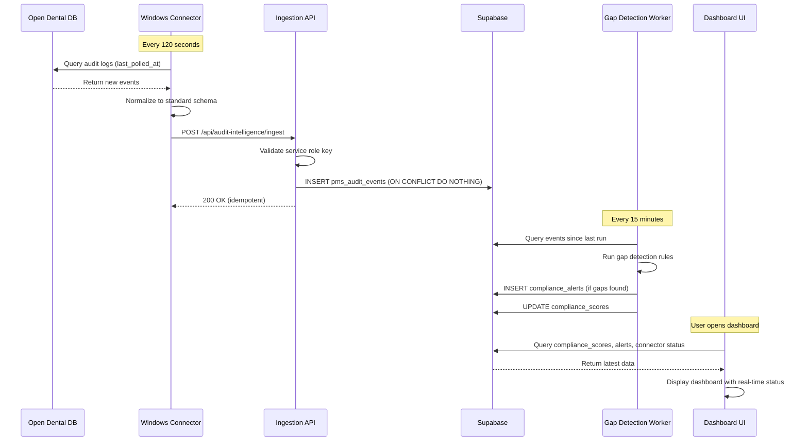

# Technical Plan: Audit Intelligence Platform

## Architectural Approach

### System Overview

The Audit Intelligence platform extends the existing ScaleHouse compliance SaaS with five new components:

1. **Windows Connector** (Node.js/TypeScript) - On-premise service that polls Open Dental MySQL database, normalizes events, and POSTs to ingestion API
2. **Ingestion API** (Next.js API route) - Receives events from connectors, validates auth, deduplicates, stores in Supabase
3. **Gap Detection Worker** (BullMQ scheduled job) - Analyzes event patterns every 15 minutes, detects compliance gaps, creates alerts
4. **MCP Tools** (Context-aware AI tools) - Extends existing AI assistant with 5 audit intelligence tools (only available in Audit Intelligence section)
5. **Document Generation Worker** (BullMQ job) - Generates compliance documents using AI + audit data, stores in Supabase Storage

**Integration with Existing Platform:**
- Shares Supabase auth (organizations, locations, users from file:supabase/migrations/002_enterprise_schema.sql)
- Extends existing AI assistant (file:src/app/api/ai-assistant/route.ts) with context-aware tools
- Reuses BullMQ worker infrastructure (file:workers/audit-report-jobs.ts pattern)
- New sidebar section "Audit Intelligence" (file:src/components/dashboard/Sidebar.tsx)
- New dashboard pages under `/dashboard/audit-intelligence/*`

### Key Architectural Decisions

**Decision 1: Polling over Webhooks (Phase 1)**

**Rationale:**
- Target customer is solo practices (not enterprise infrastructure)
- 60-120 second latency acceptable for compliance workflows (auditors care about completeness, not millisecond freshness)
- Webhook support unvalidated (need to test if `auditlog` is valid WatchTable in Open Dental's EnumWatchTable)
- Polling is simple to deploy and debug without practice modifying MySQL config

**Trade-off:** Slightly higher latency vs. proven, simple deployment

**Future Path:** Test webhooks on real Open Dental instance. If `auditlog` is valid WatchTable, Phase 2 optimization swaps poll timer for webhook trigger (transport change, not schema change). Event shape, HMAC signing, deduplication logic unchanged.

**Decision 2: Node.js/TypeScript Connector**

**Rationale:**
- Reuses existing team skills (entire codebase is TypeScript)
- Can package as Windows executable using `pkg` or `nexe`
- Shares code with Next.js app (types, validation, normalization logic)
- Easier to maintain than separate C#/.NET codebase

**Trade-off:** Less native than C#/.NET Windows Service vs. unified technology stack

**Implementation:** Use `node-windows` package to install as Windows Service, `pkg` to create standalone executable

**Decision 3: Context-Aware MCP Tools**

**Rationale:**
- Reduces tool confusion and hallucinated tool usage
- Improves model accuracy (fewer tools = better selection)
- Prevents accidental access to sensitive retrieval paths
- Makes evals cleaner (model uses only allowed tools)

**Implementation:** Build tools array dynamically in file:src/app/api/ai-assistant/route.ts based on `section` parameter:
- `section: "audit-intelligence"` → expose MCP tools + existing tools
- `section: "general"` → expose only existing 6 tools
- `section: "setup"` → expose setup-specific tools

**Decision 4: BullMQ for Document Generation**

**Rationale:**
- Handles failures gracefully (retries, dead letter queue)
- Doesn't block API requests (keeps response time <1s)
- Provides job status tracking (UI can poll for progress)
- Idempotent (can retry safely)
- Reuses existing worker infrastructure

**Trade-off:** Slightly more complex vs. robust, production-ready

**Implementation:** Extend existing worker pattern (file:workers/audit-report-jobs.ts), add new job types for 5 compliance documents

**Decision 5: New `pms_audit_events` Table**

**Rationale:**
- Different meaning: internal app actions vs. clinical PMS actions
- Different compliance expectations (ScaleHouse audit trail vs. HIPAA evidence)
- Schema mismatch: 15+ normalized fields vs. 8 fields in existing `audit_logs`
- Volume divergence: PMS events will dwarf internal logs
- Keeps internal audit trail clean for ScaleHouse's own legal/security auditing

**Trade-off:** Additional table vs. clean separation of concerns

**Decision 6: Local Encrypted Credentials**

**Rationale:**
- Minimizes breach blast radius (SaaS breach doesn't leak thousands of dental DB passwords)
- Aligns with IT expectations for on-premise agents
- Avoids "we store your clinical system credentials" trust hurdle
- Standard pattern for on-premise connectors (Salesforce, Dropbox, etc.)

**Implementation:** Use Windows DPAPI (Data Protection API) for encryption, credentials stored in `%PROGRAMDATA%\ScaleHouse\config.encrypted`

**Decision 7: Scheduled Gap Detection (15-minute intervals)**

**Rationale:**
- Near real-time (15-min latency acceptable for compliance alerts)
- More efficient than per-event detection (batch processing)
- Allows pattern analysis across multiple events
- Reduces database load

**Trade-off:** 15-minute alert delay vs. system efficiency

**Implementation:** BullMQ scheduled job (cron: `*/15 * * * *`), queries events since last run, applies detection rules, creates alerts

### Constraints

**Technical Constraints:**
- Supabase RLS requires all queries to include org_id/location_id for multi-tenancy
- Vercel serverless functions have 10-second timeout (Edge: 30s) - affects document generation
- Open Dental MySQL database is on-premise (connector must run in practice network)
- No IP address in Open Dental audit logs (only workstation name)

**Business Constraints:**
- Target solo practices (3-5 staff, 20-30 patients/day) - keep deployment simple
- Must work with existing Stripe billing (file:src/app/api/stripe)
- Must integrate with existing compliance modules (Training, Policies, Documents)

**Regulatory Constraints:**
- HIPAA requires audit logs retained for 6 years
- Chain-of-custody preservation (Open Dental's integrity hash must be stored)
- Required vs. addressable specifications affect scoring differently

---

## Data Model

### New Tables

#### 1. `pms_audit_events` - Normalized audit events from all PMS systems

```sql
CREATE TABLE pms_audit_events (
  -- Identity
  event_id          UUID PRIMARY KEY DEFAULT gen_random_uuid(),
  practice_id       UUID NOT NULL REFERENCES organizations(id) ON DELETE CASCADE,
  location_id       UUID REFERENCES locations(id) ON DELETE SET NULL,
  
  -- Source tracking (deduplication key)
  source_pms        TEXT NOT NULL,  -- 'open_dental' | 'dentrix' | ...
  source_event_id   TEXT NOT NULL,  -- OD's AuditLogNum
  
  -- Timestamps
  timestamp         TIMESTAMPTZ NOT NULL,  -- When event occurred (OD's DateTStamp)
  ingested_at       TIMESTAMPTZ DEFAULT NOW(),  -- When received by platform
  
  -- Actor (nullable - automated services have no actor)
  actor_id          TEXT,  -- OD's UserNum (string, not UUID)
  actor_name        TEXT,  -- Resolved username
  actor_role        TEXT,  -- 'provider' | 'hygienist' | 'front_desk' | 'system' | 'unknown'
  
  -- Event classification (normalized across PMS)
  event_type        TEXT NOT NULL,  -- 'authentication' | 'record_access' | 'record_modify' | 
                                     -- 'config_change' | 'data_export' | 'image_operation' | 'system_action'
  resource_type     TEXT,  -- 'patient' | 'image' | 'config' | 'security' | 'system' | null
  action            TEXT NOT NULL,  -- 'read' | 'create' | 'update' | 'delete' | 'authenticate' | 'export'
  
  -- Target
  target_entity_id  TEXT,  -- OD's PatNum (nullable)
  workstation       TEXT,  -- OD's Computer field
  
  -- Metadata
  metadata          JSONB DEFAULT '{}'::jsonb,  -- PMS-specific details (provider_name, parsed LogText, etc.)
  integrity_hash    TEXT,  -- OD's chain-of-custody hash (nullable for other PMS)
  raw_payload       JSONB,  -- Full untouched source data
  
  -- Constraints
  UNIQUE(source_pms, source_event_id)  -- Deduplication
);

CREATE INDEX idx_pms_events_practice ON pms_audit_events(practice_id, timestamp DESC);
CREATE INDEX idx_pms_events_location ON pms_audit_events(location_id, timestamp DESC);
CREATE INDEX idx_pms_events_actor ON pms_audit_events(practice_id, actor_id, timestamp DESC);
CREATE INDEX idx_pms_events_type ON pms_audit_events(practice_id, event_type, timestamp DESC);
CREATE INDEX idx_pms_events_ingested ON pms_audit_events(ingested_at);  -- For gap detection
```

#### 2. `connectors` - Tracks installed connectors and their status

```sql
CREATE TABLE connectors (
  connector_id      UUID PRIMARY KEY DEFAULT gen_random_uuid(),
  org_id            UUID NOT NULL REFERENCES organizations(id) ON DELETE CASCADE,
  location_id       UUID NOT NULL REFERENCES locations(id) ON DELETE CASCADE,
  
  -- Connector identity
  connector_name    TEXT NOT NULL,  -- User-friendly name (e.g., "Downtown Office Connector")
  machine_name      TEXT,  -- Windows computer name
  version           TEXT NOT NULL,  -- Connector version (e.g., "1.0.0")
  fingerprint       TEXT,  -- Machine fingerprint from activation
  
  -- Status
  status            TEXT NOT NULL DEFAULT 'pending_activation' 
                    CHECK (status IN ('pending_activation', 'active', 'offline', 'error', 'revoked')),
  last_sync_at      TIMESTAMPTZ,
  last_heartbeat_at TIMESTAMPTZ,
  error_message     TEXT,
  
  -- Configuration
  pms_type          TEXT NOT NULL DEFAULT 'open_dental',
  poll_interval_sec INTEGER DEFAULT 120,  -- 2 minutes default
  
  -- Polling cursor (for crash recovery)
  cursor_event_time TIMESTAMPTZ,  -- Last successfully ingested event timestamp
  cursor_event_id   TEXT,  -- Tie-breaker for same-timestamp events
  
  -- Metadata
  created_by        UUID REFERENCES auth.users(id),
  created_at        TIMESTAMPTZ DEFAULT NOW(),
  updated_at        TIMESTAMPTZ DEFAULT NOW(),
  
  UNIQUE(org_id, location_id)  -- One connector per location
);

CREATE INDEX idx_connectors_org ON connectors(org_id);
CREATE INDEX idx_connectors_status ON connectors(status, last_heartbeat_at);
```

#### 2a. `connector_activation_tokens` - One-time activation tokens

```sql
CREATE TABLE connector_activation_tokens (
  token_id          UUID PRIMARY KEY DEFAULT gen_random_uuid(),
  connector_id      UUID NOT NULL REFERENCES connectors(id) ON DELETE CASCADE,
  token_hash        TEXT NOT NULL UNIQUE,  -- Hash of activation token (never store raw)
  expires_at        TIMESTAMPTZ NOT NULL,  -- 15 minutes from creation
  used_at           TIMESTAMPTZ,  -- Null until used
  used_by_fingerprint TEXT,  -- Connector fingerprint that used this token
  created_by        UUID REFERENCES auth.users(id),
  created_at        TIMESTAMPTZ DEFAULT NOW()
);

CREATE INDEX idx_activation_tokens_connector ON connector_activation_tokens(connector_id);
CREATE INDEX idx_activation_tokens_expires ON connector_activation_tokens(expires_at);
```

#### 2b. `connector_keys` - Permanent API keys for connectors

```sql
CREATE TABLE connector_keys (
  key_id_pk         UUID PRIMARY KEY DEFAULT gen_random_uuid(),
  connector_id      UUID NOT NULL REFERENCES connectors(id) ON DELETE CASCADE,
  key_id            TEXT NOT NULL UNIQUE,  -- Public identifier (e.g., "ck_live_ABC123")
  secret_hash       TEXT NOT NULL,  -- Hashed secret for verification
  status            TEXT NOT NULL DEFAULT 'active' 
                    CHECK (status IN ('active', 'rotated', 'revoked')),
  created_at        TIMESTAMPTZ DEFAULT NOW(),
  rotated_at        TIMESTAMPTZ,
  revoked_at        TIMESTAMPTZ
);

CREATE INDEX idx_connector_keys_connector ON connector_keys(connector_id);
CREATE INDEX idx_connector_keys_status ON connector_keys(key_id, status);
```

### Component 3: Ingestion API

**Location:** New Next.js API route at `/api/ingest/audit-events`

**Responsibilities:**
- Receive batched events from connectors (up to 100 events)
- Validate HMAC signature and API key
- Deduplicate events using `source_pms + source_event_id`
- Insert valid events, return errors for invalid (partial success)
- Update connector heartbeat timestamp
- Return detailed status (accepted/rejected counts)
```

#### 3. `compliance_alerts` - Detected gaps and anomalies

```sql
CREATE TABLE compliance_alerts (
  alert_id          UUID PRIMARY KEY DEFAULT gen_random_uuid(),
  org_id            UUID NOT NULL REFERENCES organizations(id) ON DELETE CASCADE,
  location_id       UUID REFERENCES locations(id) ON DELETE SET NULL,
  
  -- Alert classification
  alert_type        TEXT NOT NULL,  -- 'shared_login' | 'missing_logs' | 'excessive_access' | ...
  severity          TEXT NOT NULL CHECK (severity IN ('low', 'medium', 'high', 'critical')),
  
  -- Status
  status            TEXT NOT NULL DEFAULT 'active' CHECK (status IN ('active', 'investigating', 'resolved', 'dismissed')),
  
  -- Details
  title             TEXT NOT NULL,
  description       TEXT,
  detected_at       TIMESTAMPTZ DEFAULT NOW(),
  resolved_at       TIMESTAMPTZ,
  resolved_by       UUID REFERENCES auth.users(id),
  
  -- Evidence (links to events that triggered alert)
  event_ids         UUID[],  -- Array of pms_audit_events.event_id
  affected_users    TEXT[],  -- Array of actor_ids
  
  -- Remediation
  recommended_actions JSONB,  -- Array of suggested remediation steps
  remediation_notes TEXT,
  
  -- Idempotency (prevents duplicate alerts)
  alert_fingerprint TEXT NOT NULL,  -- Hash of (alert_type, window_start, window_end, rule_id, affected_users)
  window_start      TIMESTAMPTZ,  -- Detection window start
  window_end        TIMESTAMPTZ,  -- Detection window end
  rule_id           TEXT,  -- Which detection rule triggered this
  
  -- Metadata
  metadata          JSONB DEFAULT '{}'::jsonb,
  created_at        TIMESTAMPTZ DEFAULT NOW(),
  updated_at        TIMESTAMPTZ DEFAULT NOW(),
  
  UNIQUE(org_id, location_id, alert_fingerprint)  -- Prevent duplicate alerts
);

CREATE INDEX idx_alerts_org ON compliance_alerts(org_id, status, severity);
CREATE INDEX idx_alerts_location ON compliance_alerts(location_id, status);
CREATE INDEX idx_alerts_detected ON compliance_alerts(detected_at DESC);
CREATE INDEX idx_alerts_fingerprint ON compliance_alerts(alert_fingerprint);
```

#### 3a. `alert_reads` - Per-user read state for alerts

```sql
CREATE TABLE alert_reads (
  alert_id          UUID NOT NULL REFERENCES compliance_alerts(id) ON DELETE CASCADE,
  user_id           UUID NOT NULL REFERENCES auth.users(id) ON DELETE CASCADE,
  read_at           TIMESTAMPTZ DEFAULT NOW(),
  PRIMARY KEY (alert_id, user_id)
);

CREATE INDEX idx_alert_reads_user ON alert_reads(user_id, read_at DESC);
```

#### 4. `compliance_scores` - Historical compliance scores

```sql
CREATE TABLE compliance_scores (
  score_id          UUID PRIMARY KEY DEFAULT gen_random_uuid(),
  org_id            UUID NOT NULL REFERENCES organizations(id) ON DELETE CASCADE,
  location_id       UUID REFERENCES locations(id) ON DELETE SET NULL,
  
  -- Overall score
  overall_score     INTEGER NOT NULL CHECK (overall_score >= 0 AND overall_score <= 100),
  
  -- Category scores
  access_control_score      INTEGER,
  authentication_score      INTEGER,
  audit_completeness_score  INTEGER,
  data_integrity_score      INTEGER,
  
  -- Breakdown
  total_requirements        INTEGER NOT NULL,
  evidenced_requirements    INTEGER NOT NULL,
  gapped_requirements       INTEGER NOT NULL,
  pending_requirements      INTEGER NOT NULL,
  
  -- Metadata
  calculated_at     TIMESTAMPTZ DEFAULT NOW(),
  
  -- Snapshot for historical tracking
  snapshot_metadata JSONB  -- Stores detailed breakdown for historical analysis
);

CREATE INDEX idx_scores_org ON compliance_scores(org_id, calculated_at DESC);
CREATE INDEX idx_scores_location ON compliance_scores(location_id, calculated_at DESC);
```

#### 5. Seed Tables (Static Mapping Data)

```sql
-- Maps Open Dental Permission types to normalized event classification
CREATE TABLE event_type_mappings (
  mapping_id        UUID PRIMARY KEY DEFAULT gen_random_uuid(),
  source_pms        TEXT NOT NULL,  -- 'open_dental'
  source_permission TEXT NOT NULL,  -- 'PatientEdit', 'UserLogOnOff', etc.
  event_type        TEXT NOT NULL,  -- 'record_modify', 'authentication', etc.
  resource_type     TEXT,
  action            TEXT NOT NULL,
  UNIQUE(source_pms, source_permission)
);

-- Maps Open Dental Permission types to CFR citations
CREATE TABLE cfr_citation_mappings (
  mapping_id        UUID PRIMARY KEY DEFAULT gen_random_uuid(),
  source_pms        TEXT NOT NULL,
  source_permission TEXT NOT NULL,
  cfr_citation      TEXT NOT NULL,  -- '§164.312(a)(2)(i)'
  citation_label    TEXT NOT NULL,  -- 'Unique User Identification'
  specification     TEXT NOT NULL CHECK (specification IN ('required', 'addressable')),
  framework         TEXT NOT NULL DEFAULT 'hipaa',  -- 'hipaa' | 'osha'
  UNIQUE(source_pms, source_permission, cfr_citation)
);

CREATE INDEX idx_cfr_mappings_pms ON cfr_citation_mappings(source_pms, source_permission);
```

### Relationships with Existing Schema

**Extends Existing Tables:**
- `organizations` - No changes needed (already has org_id, subscription_tier)
- `locations` - No changes needed (already has timezone, operating_hours for business hours inference)
- `memberships` - No changes needed (already has role-based access)

**Integrates With:**
- `training_records` (file:supabase/migrations/005_training_and_invitations.sql) - Alerts trigger training assignments
- `documents` (file:supabase/migrations/006_documents_and_storage.sql) - Generated compliance documents stored here
- `ai_audit_logs` (file:supabase/migrations/011_ai_audit_logs.sql) - MCP tool usage logged here

**Separate From:**
- `audit_logs` (file:supabase/migrations/014_audit_logs.sql) - Internal ScaleHouse actions, NOT PMS audit events

### Data Flow



---

## Component Architecture

### Component 1: Windows Connector

**Technology:** Node.js/TypeScript packaged as Windows executable

**Responsibilities:**
- Poll Open Dental MySQL database every 120 seconds
- Query audit logs using SQL JOIN (auditlog + userod + provider)
- Normalize events to standard schema
- POST events to ingestion API with authentication
- Handle auto-updates (check version on startup)
- Heartbeat to SaaS every 60 seconds

**Key Modules:**

1. **Poller** - Scheduled task that queries Open Dental
   - Uses cursor-based polling (not just timestamp):
     - Tracks `cursor_event_time` + `cursor_event_id` in local state
     - Queries with 2-minute overlap: `WHERE DateTStamp >= cursor_time - INTERVAL 2 MINUTE`
     - Handles late writes, clock drift, same-second collisions
   - Updates cursor only after successful 200/202 response from ingestion API
   - Crash recovery: cursor unchanged → events resent → server dedup handles duplicates
   - Executes SQL query with JOINs (auditlog + userod + provider)
   - Handles MySQL connection pooling and retries

2. **Normalizer** - Transforms Open Dental events to standard schema
   - Maps Permission types using `event_type_mappings` (cached from SaaS)
   - Parses freeform LogText field into structured metadata
   - Resolves actor_role from userod/provider JOINs
   - Preserves integrity_hash and raw_payload

3. **Ingestion Client** - POSTs events to SaaS API
   - Batches events (up to 100 per request)
   - HMAC signs requests using service role key
   - Implements exponential backoff on failures
   - Stores failed batches locally for retry

4. **Heartbeat** - Sends health status to SaaS
   - Every 60 seconds: POST /api/audit-intelligence/heartbeat
   - Includes: connector_id, version, last_sync_at, event_count
   - Updates `connectors.last_heartbeat_at`

5. **Auto-Updater** - Checks for new versions
   - On startup: GET /api/audit-intelligence/version
   - If new version available: download MSI, schedule installation
   - Installation happens on next service restart

**Configuration File** (`%PROGRAMDATA%\ScaleHouse\config.encrypted`):
```json
{
  "connector_id": "uuid",
  "org_id": "uuid",
  "location_id": "uuid",
  "api_endpoint": "https://app.scalehouse.com",
  "api_key_id": "ck_live_ABC123",
  "api_key_secret": "encrypted_cs_live_SECRET",
  "od_connection": {
    "host": "localhost",
    "port": 3306,
    "database": "opendental",
    "username": "encrypted_username",
    "password": "encrypted_password"
  },
  "poll_interval_sec": 120,
  "cursor": {
    "event_time": "2024-01-15T10:30:00Z",
    "event_id": "12345"
  }
}
```

**Credential Recovery:**
- If Open Dental credentials invalid: Connector shows Windows notification + reconfigure dialog
- If API key revoked: Dashboard shows "Connector Error", user clicks "Reset Connector" to generate new activation token
- Both paths supported: self-service (connector UI) + SaaS-driven (dashboard reset)

**Packaging:**
- Use `pkg` to create standalone Windows executable
- Use `node-windows` to install as Windows Service
- MSI installer created with WiX Toolset or Electron Builder

### Component 2: Connector Authentication & Activation

**Critical Security Requirement:** Each connector must have unique, revocable credentials. Using shared service role keys creates unacceptable blast radius.

**Authentication Scheme:**

1. **Per-Connector API Keys** (Key ID + Secret)
   - Each connector gets unique `key_id` (public identifier) + `key_secret` (private)
   - Stored in database: `connector_keys` table with `secret_hash`
   - Status: `active` | `rotated` | `revoked`
   - Revocable per-connector without affecting others

2. **HMAC Request Signing** (every ingestion request)
   - Connector sends headers:
     - `X-Key-Id`: Public key identifier
     - `X-Timestamp`: Unix timestamp (prevents replay)
     - `X-Nonce`: Random UUID (prevents replay)
     - `X-Signature`: HMAC-SHA256 signature
   - Server verifies:
     - Key exists and status = active
     - Timestamp within 5-minute skew window
     - Nonce not reused (Redis cache)
     - Signature matches

3. **Optional Enhancement:** Token exchange to short-lived JWT
   - Connector HMACs `/api/auth/exchange`
   - Server returns 10-15 minute JWT
   - Subsequent requests use `Bearer` token (fewer HMAC operations)
   - Deferred to Phase 2 for simplicity

**Activation Flow (3-Step Process):**

**Step 1: Dashboard Creates Activation Token**
```
POST /api/connectors/create-token
Auth: ScaleHouse user session (normal app auth)
RLS: User must have admin/owner role for org

Request:
{
  "org_id": "uuid",
  "location_id": "uuid",
  "pms_type": "open_dental",
  "connector_name": "Front Desk PC"
}

Response (200):
{
  "connector_id": "uuid",
  "activation_token": "act_live_XXXXXXXXXXXXXXXX",
  "expires_at": "2026-02-03T05:12:00Z"  // 15 minutes
}
```

**Server Behavior:**
- Create `connectors` row with `status = 'pending_activation'`
- Generate random 32-byte token (format: `act_live_...`)
- Store only `token_hash` in `connector_activation_tokens` table
- Token is one-time use, expires in 15 minutes

**Step 2: Connector Exchanges Token for Permanent Credentials**
```
POST /api/connectors/activate
Auth: None (public endpoint, rate-limited)

Request:
{
  "activation_token": "act_live_XXXXXXXXXXXXXXXX",
  "connector_fingerprint": "win:HOSTNAME|sid:...|ver:1.0.3"
}

Response (200):
{
  "connector_id": "uuid",
  "org_id": "uuid",
  "location_id": "uuid",
  "pms_type": "open_dental",
  "key_id": "ck_live_ABC123",
  "key_secret": "cs_live_SUPERSECRET",
  "ingest_base_url": "https://app.scalehouse.com/api/ingest",
  "signing": {
    "algo": "HMAC-SHA256",
    "required_headers": ["X-Key-Id", "X-Timestamp", "X-Nonce", "X-Signature"],
    "clock_skew_seconds": 300
  }
}

Errors:
- 400 invalid_token_format
- 401 token_expired
- 409 token_already_used
- 429 rate_limited
```

**Server Behavior:**
- Hash activation token and lookup in `connector_activation_tokens`
- Verify: token exists, `used_at` is null, not expired
- Mark token as used (set `used_at`, store fingerprint)
- Generate permanent API key (key_id + key_secret)
- Store `secret_hash` in `connector_keys` table
- Set `connectors.status = 'active'`
- Return credentials once (never retrievable again)

**Step 3: Ingestion Requests (After Activation)**
```
POST /api/ingest/audit-events
Auth: HMAC signed with key_secret

Headers:
  X-Key-Id: ck_live_ABC123
  X-Timestamp: 1707000000
  X-Nonce: uuid
  X-Signature: base64(HMAC-SHA256(...))

Body:
{
  "events": [
    {
      "source_event_id": "open_dental:12345",
      "timestamp": "2026-02-03T05:01:00Z",
      "actor_id": "42",
      "actor_name": "Dr. Smith",
      ...
    }
  ]
}

Response (202 Accepted):
{
  "accepted": 45,
  "rejected": 0,
  "errors": []
}
```

**Key Rotation & Revocation:**
- `POST /api/connectors/{connector_id}/rotate-key` - Returns new key_secret once, marks old key as rotated with grace period
- `POST /api/connectors/{connector_id}/revoke` - Immediately blocks ingestion, keeps historical data

### Component 3: Ingestion API

**Location:** New Next.js API route at `/api/ingest/audit-events`

**Responsibilities:**
- Receive batched events from connectors (up to 100 events)
- Validate HMAC signature and API key
- Deduplicate events using `source_pms + source_event_id`
- Insert valid events, return errors for invalid (partial success)
- Update connector heartbeat timestamp
- Return detailed status (accepted/rejected counts)

**HMAC Signature Validation:**
```typescript
// Pseudo-code for signature verification
const signature = headers['x-signature'];
const keyId = headers['x-key-id'];
const timestamp = headers['x-timestamp'];
const nonce = headers['x-nonce'];

// 1. Lookup key
const key = await db.query('connector_keys WHERE key_id = ?', keyId);
if (!key || key.status !== 'active') return 401;

// 2. Check timestamp (prevent replay)
if (Math.abs(Date.now()/1000 - timestamp) > 300) return 401;  // 5-min window

// 3. Check nonce (prevent replay)
if (await redis.exists(`nonce:${nonce}`)) return 401;
await redis.setex(`nonce:${nonce}`, 600, '1');  // Cache for 10 min

// 4. Verify signature
const payload = `${timestamp}.${nonce}.${JSON.stringify(body)}`;
const expectedSig = HMAC_SHA256(key.secret, payload);
if (signature !== expectedSig) return 401;
```

**Batch Processing (Partial Success):**
- Validate each event individually
- Insert valid events with `ON CONFLICT (source_pms, source_event_id) DO NOTHING`
- Collect errors for invalid events
- Return detailed response:
  ```typescript
  {
    accepted: 45,      // Successfully inserted
    duplicates: 5,     // Already existed (dedup)
    rejected: 2,       // Invalid data
    errors: [
      { index: 12, error: "Invalid timestamp format" },
      { index: 47, error: "Missing required field: actor_id" }
    ]
  }
  ```

**Implementation Pattern:**
- New API route (not extending existing audit-logs route)
- Uses Supabase admin client for writes (bypasses RLS)
- Updates `connectors.last_sync_at` and `last_heartbeat_at` on successful ingestion
- Logs invalid events to separate error table for debugging

### Component 4: Gap Detection Worker

**Location:** New BullMQ worker at `workers/gap-detection.ts`

**Architecture:** Scheduler + Per-Location Jobs (prevents overlaps)

**Scheduler (Cron Job):**
- Runs every 15 minutes: `*/15 * * * *`
- Acquires Redis lock (60-120 sec TTL) to ensure single scheduler instance
- Queries active locations/connectors
- Enqueues one job per location with deterministic job ID: `gapdetect:{location_id}:{time_bucket}`
- Time bucket = `floor(now / 15 minutes)` - prevents duplicate enqueues
- BullMQ refuses duplicate job IDs automatically

**Per-Location Worker Jobs:**
- Process one location at a time
- Load detection state (last scan time, baselines)
- Query events since last scan for this location
- Apply detection rules (shared logins, missing logs, excessive access)
- Create alerts with fingerprint for idempotency
- Update compliance scores
- Concurrency: 10-50 workers (configurable)

**Concurrency Control:**
- Per-location Redis lock: `lock:gapdetect:{location_id}` (TTL = expected runtime + buffer)
- If locked, skip run (newer job will process)
- Prevents overlapping scans of same location
- Allows parallel processing of different locations

**Alert Idempotency:**
- Unique constraint on alert fingerprint:
  ```sql
  UNIQUE(org_id, location_id, alert_type, window_start, window_end, rule_id)
  ```
- Duplicate detection attempts create no duplicate alerts
- Safe for retries and overlapping runs

**Responsibilities:**
- Apply detection rules (shared logins, missing logs, excessive access)
- Create alerts in `compliance_alerts` table (idempotent)
- Update compliance scores in `compliance_scores` table
- Trigger notifications (Supabase Realtime handles delivery)

**Detection Rules (Tier 2 - Statistical Anomaly Detection):**

1. **Shared Login Detector**
   - Query: Same actor_id on different workstations within 5 minutes
   - Query: Activity volume exceeds 2x practice baseline (requires 7-day calibration)
   - Severity: High (hard HIPAA violation)

2. **Missing Logs Detector**
   - Query: 8+ hour gap during inferred business hours (no events)
   - Query: Expected event_type drops to zero (coverage gap)
   - Severity: Medium to High
   - Requires: 7-day baseline to infer business hours

3. **Excessive Access Detector**
   - Query: Daily access count exceeds 2x rolling 30-day average (elevated) or 3x (anomalous)
   - Hard-coded: CommandQuery events (always flag)
   - Hard-coded: PatientDOBView/PatientSSNView when masking enabled
   - Severity: Medium
   - Requires: 30-day baseline for rolling average

**Implementation Pattern:**
- Follows existing worker pattern (file:workers/audit-report-jobs.ts)
- Uses BullMQ scheduled jobs (not event-driven)
- Stores detection state in `gap_detection_state` table (last_run_at, baselines)

### Component 5: MCP Tools (Context-Aware AI Assistant)

**Location:** Extends existing AI assistant (file:src/app/api/ai-assistant/route.ts)

**Context-Aware Implementation:**
- Add `section` parameter to POST request body
- Build tools array dynamically based on section:
  ```typescript
  const { section = 'general' } = req.body;
  const tools = buildToolsForContext(section, orgId, locationId);
  ```
- UI passes section from current route (e.g., `/dashboard/audit-intelligence` → `section: 'audit-intelligence'`)

**New Tools (5 MCP Tools):**

1. **`get_audit_log_slice`** - Query audit logs by filters
   ```typescript
   Input: { start_date, end_date, user_id?, event_type?, limit? }
   Output: { events: [...], total_count, has_more }
   ```

2. **`summarize_risk`** - Analyze audit data for risk indicators
   ```typescript
   Input: { date_range, focus_area? }
   Output: { risk_score, findings: [...], recommendations: [...] }
   ```

3. **`generate_audit_packet`** - Create compliance document bundle
   ```typescript
   Input: { document_type, date_range, include_sections? }
   Output: { job_id, status: "queued", estimated_time_sec }
   ```

4. **`detect_anomalies`** - Find suspicious patterns
   ```typescript
   Input: { date_range, anomaly_types?, threshold? }
   Output: { anomalies: [...], severity_breakdown }
   ```

5. **`check_compliance_gaps`** - Identify missing controls or evidence
   ```typescript
   Input: { framework: "hipaa" | "osha" }
   Output: { gaps: [...], score, missing_requirements: [...] }
   ```

**Context-Aware Tool Loading:**
```typescript
// In file:src/app/api/ai-assistant/route.ts
const tools = buildToolsForContext(section);

function buildToolsForContext(section: string) {
  const baseTools = [...existingTools];  // 6 existing tools
  
  if (section === "audit-intelligence") {
    return [...baseTools, ...mcpTools];  // Add 5 MCP tools
  }
  
  return baseTools;  // Default: only existing tools
}
```

**Integration:**
- MCP tools query `pms_audit_events` table
- `generate_audit_packet` enqueues BullMQ job, returns job_id
- Tools respect location_id context (only show data for active location)
- All tool usage logged in `ai_audit_logs` (existing table)

### Component 6: Document Generation Worker

**Location:** New BullMQ worker at `workers/compliance-document-generation.ts`

**Responsibilities:**
- Process document generation jobs from queue
- Query audit events and compliance data
- Call Anthropic API to generate document content
- Render to PDF/Word using existing libraries (jspdf, docx)
- Store in Supabase Storage
- Update job status for UI polling

**Job Types (5 Critical Documents):**
1. `security_risk_assessment` - Annual comprehensive review
2. `audit_log_summary` - Access control report
3. `training_records` - Compliance training documentation
4. `exposure_control_plan` - OSHA incident reports
5. `baa_registry` - Business Associate tracking

**Implementation Pattern:**
- Follows existing pattern (file:workers/audit-report-jobs.ts)
- Uses `doc_jobs` table (file:supabase/migrations/013_doc_jobs.sql) or new `compliance_doc_jobs` table
- Stores generated PDFs in Supabase Storage bucket `compliance-documents`
- Job status: `queued` → `processing` → `completed` | `failed`

**Document Generation Flow:**
1. User clicks "Generate Audit Summary" (or asks AI)
2. API enqueues job: `{ type: "audit_log_summary", params: { date_range, ... } }`
3. Worker picks up job
4. Worker queries `pms_audit_events` for date range
5. Worker calls Anthropic API with prompt + audit data
6. Worker renders AI response to PDF using jspdf
7. Worker uploads PDF to Supabase Storage
8. Worker updates job status to `completed` with download URL
9. UI polls job status, shows download button when ready

### Component 7: Compliance Mapping Engine

**Location:** New module at `src/lib/compliance/mapping.ts`

**Responsibilities:**
- Map events to CFR citations (Tier 1 - deterministic)
- Calculate compliance scores
- Provide evidence for requirements

**Key Functions:**

1. **`mapEventToCitations(event)`** - Returns CFR citations for event
   - Queries `cfr_citation_mappings` table
   - Returns array of citations with required/addressable flag

2. **`calculateComplianceScore(org_id, location_id)`** - Computes score
   - Queries all CFR citations for framework (HIPAA/OSHA)
   - For each citation, checks if evidence exists in `pms_audit_events`
   - Status: evidenced (has events) | gapped (no events or anomaly detected) | pending (no data yet)
   - Weighted average: required specs weighted 2x addressable specs
   - Returns overall score + category breakdown

3. **`getEvidenceForRequirement(citation)`** - Returns supporting events
   - Queries `pms_audit_events` filtered by event_type that maps to citation
   - Used for document generation and audit packet creation

**Integration:**
- Called by Gap Detection Worker to update scores
- Called by MCP tools to answer compliance questions
- Called by Document Generation Worker to gather evidence

### Integration Points

**With Existing Platform:**

1. **AI Assistant** (file:src/app/api/ai-assistant/route.ts)
   - Add `section` parameter to POST request body
   - UI passes section from current pathname (e.g., `/dashboard/audit-intelligence` → `section: 'audit-intelligence'`)
   - Dynamically build tools array based on section
   - MCP tools query `pms_audit_events` instead of existing tables

6. **Real-Time Notifications**
   - Primary: Supabase Realtime subscriptions on `compliance_alerts` table (INSERT events)
   - Fallback: UI polls `/api/alerts/unread` every 30-60 seconds
   - Per-user read state tracked in `alert_reads` table
   - Toast notifications shown when new alert INSERT event received
   - Badge count = unread alerts for current user

2. **Training System** (file:src/app/api/training)
   - Alerts can trigger training assignments
   - New API: `POST /api/training/assign-from-alert`
   - Links alert_id to training_record

3. **Risk Assessments** (file:src/lib/compliance/risk.ts)
   - Audit data feeds into risk score calculation
   - New function: `getAuditRiskFactors(org_id, location_id)`
   - Returns risk indicators from gap detection

4. **Policies** (file:src/app/dashboard/policies)
   - Audit events provide evidence for policy compliance
   - New view: "Evidence" tab shows events supporting each policy

5. **Sidebar Navigation** (file:src/components/dashboard/Sidebar.tsx)
   - Add "Audit Intelligence" to coreNav array
   - Badge shows unread alert count
   - Sub-routes: `/dashboard/audit-intelligence`, `/dashboard/audit-intelligence/connectors`, `/dashboard/audit-intelligence/alerts`

### External Dependencies

**New Dependencies:**
- `mysql2` - MySQL client for Open Dental database (connector only)
- `node-windows` - Windows Service wrapper (connector only)
- `pkg` or `nexe` - Package Node.js as executable (connector only)
- `crypto` (built-in) - DPAPI encryption for credentials (connector only)

**Existing Dependencies (Reused):**
- `@anthropic-ai/sdk` - AI document generation
- `bullmq` - Job queue for workers
- `@supabase/supabase-js` - Database access
- `jspdf`, `docx` - Document rendering

### Deployment Architecture

**Connector:**
- Deployed on-premise at each practice location
- Runs as Windows Service (auto-start on boot)
- MSI installer downloaded from SaaS dashboard
- Auto-updates on startup (checks version API)

**SaaS Platform (Existing Vercel Deployment):**
- Next.js app with new API routes
- BullMQ workers (existing infrastructure)
- Supabase database with new tables
- No infrastructure changes needed

**Data Storage:**
- Supabase PostgreSQL (audit events, alerts, scores)
- Supabase Storage (generated compliance documents)
- Redis (BullMQ job queue - existing)

### Security Considerations

**Connector Security:**
- Service role key stored encrypted using Windows DPAPI
- Open Dental credentials encrypted in local config
- HTTPS only for all API communication
- Certificate pinning for ingestion API (prevent MITM)

**API Security:**
- Service role key validation on ingestion endpoint
- Rate limiting per connector (prevent abuse)
- Request signing with HMAC (optional enhancement)
- RLS policies on all new tables

**Data Security:**
- PMS audit events contain PHI (patient IDs, names in metadata)
- RLS policies restrict access to org members only
- Generated documents stored in private Supabase Storage bucket
- Audit trail of all AI assistant queries (existing `ai_audit_logs`)

### Scalability Considerations

**Phase 1 (MVP):**
- Target: 100 practices, 1-2 locations each
- Event volume: ~200 events/day per practice = 20K events/day total
- Storage: ~1GB/month (with 6-year retention = 72GB total)
- Supabase free tier supports up to 500MB, paid tier unlimited

**Phase 3 (DSO Scale):**
- Target: 50 DSOs with 10-50 locations each = 500-2500 locations
- Event volume: 100K-500K events/day
- Storage: 50-250GB/month
- May need database partitioning by month/year
- May need separate read replicas for analytics

**Current Design Supports:**
- Horizontal scaling: Each connector is independent
- Database indexes optimized for time-range queries
- BullMQ workers can scale horizontally (add more worker processes)
- No architectural changes needed for Phase 3 scale

---

## Critical Path for Phase 1

**Week 1-2: Foundation**
1. Create database migrations (new tables)
2. Seed compliance mapping tables (event_type_mappings, cfr_citation_mappings)
3. Build ingestion API route
4. Build connector activation flow in dashboard

**Week 3-4: Connector**
5. Build Node.js connector (poller, normalizer, ingestion client)
6. Package as Windows executable
7. Create MSI installer
8. Test on local Open Dental instance

**Week 5-6: Intelligence Layer**
9. Build gap detection worker (3 detection rules)
10. Build compliance score calculator
11. Add MCP tools to AI assistant (context-aware)
12. Build Audit Intelligence dashboard UI

**Week 7-8: Document Generation**
13. Build document generation worker (5 document types)
14. Integrate with AI assistant (generate_audit_packet tool)
15. Build document preview/edit UI
16. End-to-end testing

**Week 9-10: Polish & Launch**
17. Error handling and edge cases
18. Connector auto-update mechanism
19. Alert notification system
20. Beta testing with pilot customer

---

## Open Questions for Validation

1. **Open Dental Webhook Support** - Test if `auditlog` is valid WatchTable (1-hour test on real instance)
2. **LogText Parsing** - Test against real LogText values to finalize metadata extraction logic
3. **Baseline Calibration** - Validate 7-day and 30-day baseline windows with pilot customer
4. **Document Quality** - User testing of AI-generated compliance documents for regulatory acceptance
